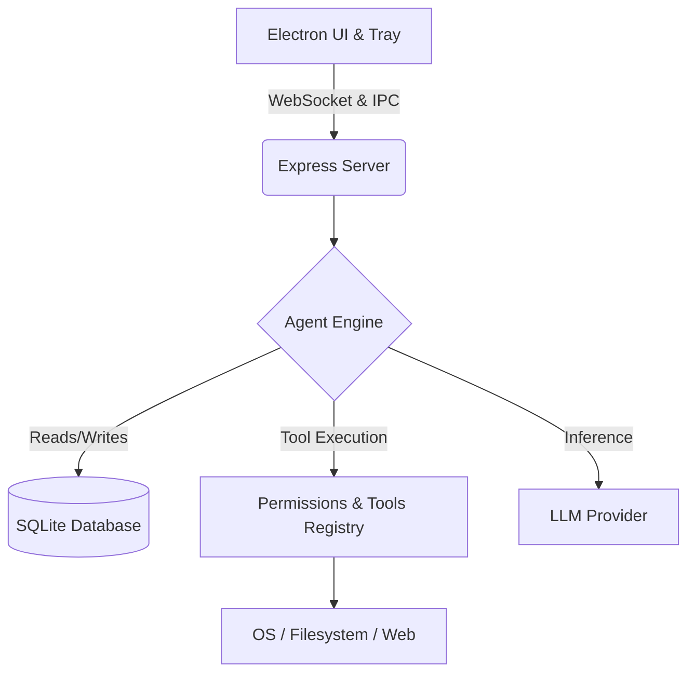

# 🤖 FRIDAY AI — Your Autonomous Personal AI Agent

<div align="center">

**An elite, self-healing, continuously learning AI personal assistant — built with Electron, powered by LLMs.**

FRIDAY is your dedicated JARVIS: fiercely loyal, proactive, witty, and brilliant.

</div>

---

## ✨ Features

| Feature | Description |
|---|---|
| 🧠 **Self-Healing Intelligence** | Never says "I can't" — auto-searches, auto-recalls skills, retries with different approaches |
| ⚡ **38 Built-in Tools** | File management, app launching, web search, scheduling, reminders, goals, email, system info |
| 📚 **Skill Learning** | Learns new capabilities and recalls them automatically |
| 🔗 **Knowledge Graph** | Persistent memory across conversations with semantic extraction |
| ⏰ **Scheduling & Reminders** | Full CRUD for schedules, reminders, goals with notifications |
| 💊 **System Health Monitoring** | Proactive disk/CPU/memory monitoring with alerts |
| 🎯 **User Shortcuts** | Learn your language — "when I say X, do Y" |
| 📋 **Smart Clipboard** | Auto-detects clipboard content type and suggests actions |
| 🔄 **Self-Evolution** | Can read and modify its own codebase |
| 💾 **Persistent State** | Session survives restarts — never forgets |
| 🔒 **Security-First** | AES-256-GCM encryption, CSP headers, input sanitization, path validation |

## 🚀 Overview

FRIDAY is a sophisticated agentic system designed to sit transparently on your desktop, perceive your environment, and execute complex goals autonomously. Unlike traditional wrappers that simply forward text to an LLM, FRIDAY uses a robust chain-of-thought engine to reason, schedule, use tools, create workflows, and learn from its interactions.

It is heavily optimized for builders, researchers, and entrepreneurs, focusing on speed and actionable execution over simple chat replies.

## 🏗️ Architecture

FRIDAY operates using a decoupled architecture, combining a lightweight desktop shell with a heavy robust agent backend.



1. **The Desktop Shell (`main.js`)**: An Electron app that runs as a stealth, borderless widget. It registers global hotkeys (e.g., `Ctrl+Shift+F`) to instantly summon the UI over any active window.
2. **The Server & Backend (`server.js`)**: An Express and WebSocket server running on `localhost:47777`. It handles API requests, real-time message streaming, and state persistence.
3. **The Agent Engine (`engine.js`)**: The brain of FRIDAY. It runs the recursive LLM "Agentic Loop" connecting thinking strategies with actionable tools.
4. **Persistent Memory (`database.js`)**: A local `SQLite` database that permanently stores user profiles, daily stats, chat history, deferred schedules, and parsed shortcuts.
5. **Tool Registry (`tools.js`)**: A gated framework where all OS commands, file reading/writing, and web scraping capabilities are defined and executed.

## ⚙️ How It Works (The Agentic Loop)

When a command is received, FRIDAY executes a multi-step synchronous loop:

1. **Context Assembly**: Before talking to the LLM, FRIDAY builds a colossal system prompt. It injects the exact internal time, the user's active goals, pending reminders, current clipboard content, recently learned skills, and previous chat summaries.
2. **Chain-of-Thought Scratchpad**: FRIDAY uses an internal `<think>...</think>` mechanism. Before acting, it plots a plan internally (e.g., "The user wants X. Let me check my memory. I don't know how to do X. Let me search the web, execute a command, and then summarize").
3. **Tool Execution & Self-Healing**: FRIDAY attempts to execute tools natively. If a tool fails (e.g., a bad path or missing parameter), it parses the error locally into its scratchpad, recalibrates, and tries a different approach up to `MAX_RETRIES` times.
4. **Self-Evaluation**: After responding, FRIDAY background-executes a `_selfEvaluate` prompt to check if it accurately fulfilled the user's command. If it detects a hallucination, it auto-corrects.
5. **Continuous Learning**: Background processes analyze interactions to map new shortcuts ("when I say X, do Y") and store successful complex multi-tool procedures as permanent `skills`.

## 🌟 Capabilities 

### 💻 Deep OS & Filesystem Integration
- **File Management**: Read from, write to, and traverse up and down local directories securely.
- **Process Management**: Request a list of active windows and running applications to know what context the user is currently working inside.
- **App Launching**: Launch applications or custom user-defined scripts dynamically.
- **Run Commands**: Native capability to run bash/powershell commands (gated behind strict security protocols).
- **Smart Clipboard**: Proactively reads your clipboard to suggest contextual actions (e.g., automatically downloading code or extracting text from copied URLs).

### 🧠 Persistent Memory & Empathy
- Maintains a long-term **User Profile** tracking facts about your workflow.
- Connects cross-session concepts via a sprawling **Knowledge Graph**.
- Extracts **Shortcuts** natively based on your conversational habits to execute faster next time.

### ⏰ Advanced Scheduling
- **Deferred Actions**: You can tell FRIDAY: *"Remind me to push my code in 30 minutes, and automatically open my terminal for me when you do."* FRIDAY suspends the tool call and native polling processes trigger it precisely when asked.
- **Goals Tracking**: Complete native CRUD tracking for your daily objectives and reminders.

### 🌐 Web Intelligence
- Implements fallback search strategies (You.com, DuckDuckGo Instant Answers, Wikipedia API).
- Instantiates background instances to literally scrape, render, and process deep web pages for summarization and logic parsing.

## 📦 Installation & Setup

1. **Clone the repository**
   ```bash
   git clone https://github.com/your-username/friday-ai.git
   cd friday-ai
   ```

2. **Install dependencies**
   ```bash
   npm install
   ```

3. **Start the application**
   ```bash
   npm start
   ```

4. **Summon FRIDAY**
   * The app minimizes to the system tray. Use the global shortcut `Ctrl+Shift+F` (or your defined keybind) to reveal the main widget!

## 🛡️ Security

With great power comes strict guardrails. 
- FRIDAY sanitizes inputs via `DOMPurify` before rendering to the Electron frame.
- Direct execution commands (`run_command`) and file traversing are gated by explicit **Allowed / Restricted** paths configured via your Admin Panel.
- It operates strictly over localhost WebSockets.

## 🤝 Contributing
Contributions, issues, and feature requests are always welcome! Feel free to check the issues page or submit PRs regarding new Tools or Memory modules!
